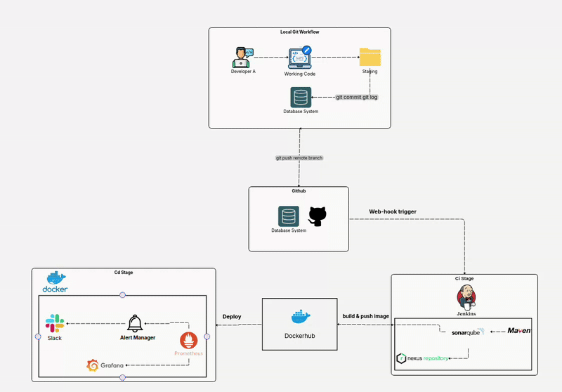
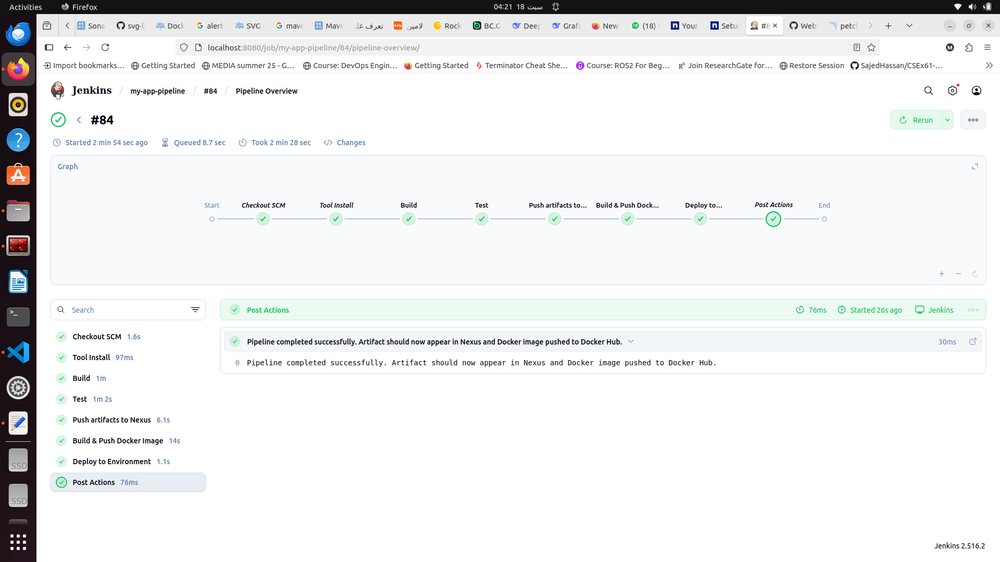

# 🚀 CI/CD Pipeline Automation Project

## 📌 Overview

A complete **CI/CD pipeline** automating the software lifecycle from commit to deployment and monitoring — covering SCM, CI, testing, code quality, containerization, artifact management, deployment, and observability.

---

## 🏗️ Architecture

Three stages:
1. **Local Dev Workflow** — Developer → Working Dir → Staging → Commit
2. **CI Stage** — GitHub → Jenkins → Build → SonarQube → Nexus → Docker → Docker Hub
3. **CD & Monitoring** — Docker Hub → Deployment Server → Prometheus/Grafana → Alert Manager → Slack

---

## 🔄 Pipeline Flow

---

# ⚙️ Continuous Integration (CI)

## Jenkins Pipeline

Jenkins automates the build and integration process.

Pipeline stages include:

- Source code checkout
- Application build
- Automated testing
- Code quality analysis
- Artifact storage

Tools used:

- Jenkins
- Maven
- SonarQube
- Nexus Repository

(Add Jenkins pipeline screenshot)

---

# 🔍 Code Quality Analysis

## SonarQube

SonarQube performs static code analysis to identify:

- Bugs
- Vulnerabilities
- Code quality issues

(Add SonarQube screenshot)

---

# 📦 Artifact Management

## Nexus Repository

Nexus is used to store and manage:

- Application artifacts
- Dependencies
- Build packages

(Add Nexus screenshot)

---

# 🐳 Containerization

## Docker

The application is containerized using Docker to provide:

- Consistent environments
- Easy deployment
- Application isolation

## Docker Hub

Docker images are stored and managed using Docker Hub.

(Add Docker/Docker Hub screenshot)

---

# 🚀 Continuous Deployment (CD)

The deployment stage automatically pulls the Docker image and deploys the application to the target environment.

Workflow:

(Add Deployment screenshot)

---

# 📊 Monitoring & Observability

## Prometheus

Prometheus collects application and infrastructure metrics.

(Add Prometheus screenshot)

## Grafana

Grafana visualizes metrics through monitoring dashboards.

(Add Grafana dashboard screenshot)

## Alert Manager

Alert Manager handles system alerts and notifications.

(Add Alert Manager screenshot)

## Slack Notifications

Slack integration provides real-time notifications for:

- Deployment status
- Failures
- Monitoring alerts

(Add Slack screenshot)

---

# 🛠️ Technologies Used

| Category | Tools |
|----------|-------|
| Version Control | Git, GitHub |
| CI/CD Automation | Jenkins |
| Build Tool | Maven |
| Code Quality | SonarQube |
| Artifact Repository | Nexus |
| Containerization | Docker |
| Container Registry | Docker Hub |
| Monitoring | Prometheus |
| Visualization | Grafana |
| Alerting | Alert Manager |
| Notifications | Slack |

---

# 🔄 Complete Pipeline Flow

---

# ✅ Project Benefits

- Automated CI/CD workflow
- Faster software delivery
- Improved code quality
- Reliable deployments
- Real-time monitoring

---

# 🚀 Future Improvements

- Kubernetes deployment
- Infrastructure as Code using Terraform
- Security scanning using Trivy
- GitOps workflow using ArgoCD

---

# 👨‍💻 Author

**DevOps Engineer**

